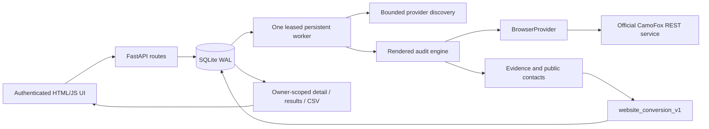

# Phase 3B evidence architecture

## Storage and compatibility

Additive migration **50** creates `search_jobs`, `search_job_items`, `businesses`,
`business_sources`, `audit_runs`, `audit_pages`, `audit_evidence`,
`business_contacts`, `lead_scores`, plus claim/read indexes. The migration is an
atomic SQLite transaction and a migration error fails startup. Existing legacy
`leads`, IDs, scores and related history are not deleted, mass-converted or updated
by the new worker. The new tables are authoritative for active results/detail/CSV;
the old table is preserved as historical data, not silently labeled new evidence.

Business identity uses provider namespace/record ID plus a deterministic composite
of normalized name, city, state and physical address. Without an address it also
uses phone or domain. Domain alone never merges branches. Conservative composites
can leave duplicates when provider addresses differ; fuzzy entity resolution is
future work. Each provider association and observation time remains available.

Contacts are unique within an audit by type/value/source URL. Repeated audits keep
historical runs, evidence, contacts and scores. Detail returns the latest owned
audit and up to 100 run summaries. The database retains older runs beyond that
view. Data is public business information; this remains one local workspace,
not a multi-tenant SaaS security model.

## Worker and lifecycle

- Job states: queued, running, completed, partial, failed, cancelled.
- Item states: pending, processing, completed, failed, skipped, cancelled.
- Audit states include running, completed, partial, blocked, failed, unverified,
  cancelled. Evidence uses present, absent, unknown, blocked, failed, not_applicable.
- One job at a time across local claimants. `BEGIN IMMEDIATE` serializes job/item
  claims; no transaction encloses a network await. A 60-second worker lease is
  heartbeated every ten seconds. Every state write checks the current lease owner.
- At startup and subsequent polls, expired running leases are recovered. Processing
  items restart from the beginning, with at most three interrupted attempts;
  completed items are preserved. Interrupted runs remain as failed history.
  Graceful shutdown releases unfinished work back to queued immediately.
- Discovery cursors/page counts persist after each page. Duplicate results on a
  replay are ignored. The page cap also bounds repeated provider tokens.
- One search can queue ten active requests per owner; excess returns 429 with
  Retry-After. This is not a distributed scheduler. Use one Uvicorn process.
- Browser audit concurrency is 1–2, default 2. Default page budget is 3, config
  hard cap 4; current selector visits only home, one contact/quote and one about
  **or** services page, therefore currently uses at most 3 even with cap 4.
- Cancellation is persistent and checked between safe operations. Pending items
  are cancelled immediately; active browser work reaches a bounded safe boundary
  then tears down. SSE disconnects and refreshes never cancel work.
- `qualified_count` means a business with a completed page and enough assessable
  evidence to compute a gap; it is not a sales-qualified lead or predicted intent.
  Missing websites stay unverified. Failed/blocked audits produce partial jobs.
  Provider exhaustion/caps yield partial jobs even if every returned item finishes.

APIs: POST `/api/leadgen/start`; GET `/api/leadgen/jobs`, `/api/leadgen/jobs/{id}`,
`/items`; POST `/api/leadgen/jobs/{id}/cancel`; GET `/api/businesses/{id}`.
The compatibility status and SSE endpoints read persisted state. All job/detail,
list and export reads enforce authenticated owner access. Polling resumes from
the server's recent-job list even when browser localStorage loses the job ID.

## Discovery and website verification

Google Places Legacy Text Search uses documented `next_page_token` (up to three
pages), bounded token activation retry and Details for every selected result,
rather than only the former first five. Yelp uses documented `offset`/`limit`,
bounded by the official 240-result maximum and configured pages. The default page
limit is three per provider (config 1–5; Google remains capped at three), with
at most 20 selected results per request. Details calls cost additional quota.

Serper Maps uses the official maps endpoint, but its public documentation did not
establish a stable pagination contract at implementation time. It deliberately
returns one page and `provider_limit` when the target is unmet. No guessed page or
cursor parameter is sent. Quota/auth failures are normalized without credential
leakage. Provider keys remain optional at startup.

Only an explicit authoritative provider website is eligible. Yelp's business URL
is listing provenance, never the website. Yelp domain guessing remains absent from
the active path. Public URL/DNS policy and a rendered successful destination then
verify reachability. Cross-host redirects beyond a www alias are conservatively
stopped; no search-based domain resolver is introduced. Without an authoritative
website, retain the business and provider phone/source without an invented audit.

Official contracts: [Google Text Search Legacy](https://developers.google.com/maps/documentation/places/web-service/legacy/search-text),
[Google Details Legacy](https://developers.google.com/maps/documentation/places/web-service/legacy/details),
[Yelp business search](https://docs.developer.yelp.com/reference/v3_business_search),
[Serper](https://serper.dev/). Provider retention/attribution terms still apply.

## Rendered evidence

The fixed read-only JavaScript extracts bounded facts, not HTML. It filters hidden
elements and script text out of email/phone candidates. Visible mailto/tel and
visible business contact text carry source URL, excerpt, locator, confidence and
observation time. Email normalization rejects examples/assets/source artifacts;
no guessed patterns or personal enrichment exists. US phone normalization keeps
display text and produces validated +1 NANP numbers with optional extension.

Page detectors include reachability/final URL/HTTPS/title/viewport/ready state;
emails, phones, mailto/tel/contact path; Facebook/Instagram/company-only LinkedIn/
YouTube links; contact/quote/booking forms; contact/call/quote/booking and primary
CTAs; booking/chat resource signatures; WordPress/Wix/Squarespace/Shopify; GA/GTM/
Meta Pixel signatures. Forms inspect rendered fields, labels, headings, text,
buttons and action attributes. Newsletter, login and search forms are rejected.
Widget/analytics non-observation stays unknown because delayed/blocked resources
can conceal them. No contact is inferred from arbitrary script content.

The viewport endpoint enables a 390×844 Firefox overflow measurement. Viewport
metadata remains a separate detector. Neither proves real mobile-device or
Chromium usability. Navigation milliseconds are diagnostic only. Optional Google
PageSpeed is a separate timestamped mobile performance measurement; missing keys
or failures remain unknown, and its raw response is discarded.

Only known present evidence survives a partial audit as present. Absence needs
completed coverage with no unknown/blocked/failed competing observation. Even
then absence means “not observed on the bounded assessed pages,” not site-wide
proof. Evidence has version `rendered_dom_v1` and stable stored IDs used in score
breakdowns. Blocks/challenges/login walls stop further work; no bypass is attempted.

## Deterministic score: website_conversion_v1

All values are 0–100 or null when unassessable. No AI, revenue, staff-size or intent
estimate participates.

| Conversion component | Weight |
| --- | ---: |
| Contact CTA | 15 |
| Primary conversion CTA | 15 |
| Click to call | 10 |
| Contact form | 15 |
| Quote form, applicable service categories | 10 |
| Booking form, applicable appointment categories | 10 |
| Measured mobile overflow | 10 |
| Contact page | 10 |
| Optional measured PageSpeed | 5 |

For binary assessed components, missing = 100 gap points, present = 0. For measured
PageSpeed, gap points = 100 minus the performance score. Unknown/blocked/failed/
not-applicable components are excluded from the assessed denominator. Quote/booking
applicability uses explicit category keyword lists in `scoring.py`; observed forms
remain assessable regardless of category. At least three components and 35% of
applicable weight must be assessed before assigning a Digital Gap.

`DigitalGap = sum(weight × gap_points) / sum(assessed weights)`.

Business Strength uses provider rating/5 ×100 (weight 60), log-scaled review count
`min(100, log(1+n)/log(501)×100)` (weight 30), and confirmed website reachability
(weight 10). Only known components enter its denominator; a website alone does
not establish strength. Missing rating/review evidence leaves strength null.
Provider provenance is available beside the breakdown; no invented financial
or company-size attributes are used.

`Opportunity = 0.70 × DigitalGap + 0.30 × BusinessStrength`.
If strength is unknown, use gap alone and label `gap_only`. If gap is unassessable,
opportunity is null even when provider reputation is strong. Scores round to two
decimals and never leave 0–100.

`EvidenceConfidence = 100 × assessed/applicable weight × weighted detector
confidence × completed/attempted page coverage`. Blocked/failed coverage lowers
confidence; it does not generate missing-feature points. `ContactConfidence` is
100 times the strongest public contact confidence: mailto/tel .98, visible text
.80, provider-only phone .50, none 0. Contacts do not add Digital Gap points.
The five dimensions stay separate in the API/UI/CSV. Breakdowns retain component
statuses, weights, evidence IDs, formula, coverage, fallback and profile version.

## Limitations and Phase 3C boundary

CamoFox is Firefox-based; no Chromium verification adapter is implemented. SQLite
and a local worker remain; no distributed queue, billing or multi-tenant SaaS.
There is no production browser network sandbox. Provider coverage depends on
contracts/quotas, and blocked sites remain blocked. Future work may include
network/container isolation, optional Chromium checks, larger benchmarks, provider
contract hardening, better entity resolution and score calibration. PostgreSQL/
Redis should be considered only when measured scale requires them. Phase 3C is
not started by this implementation.
